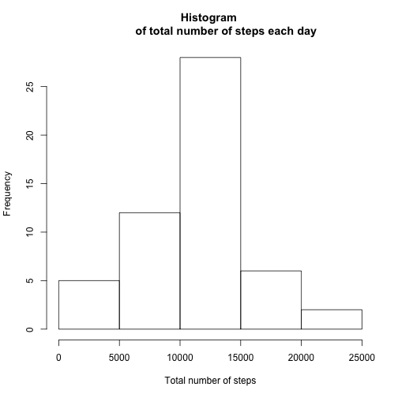
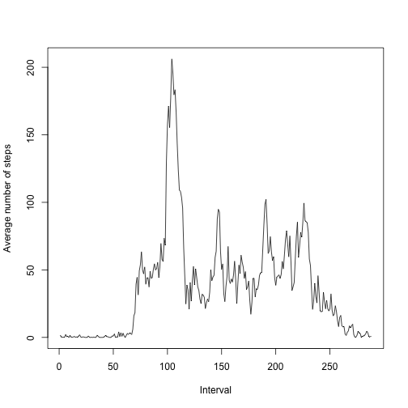
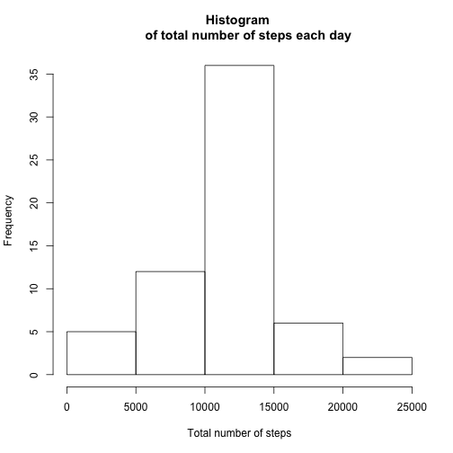
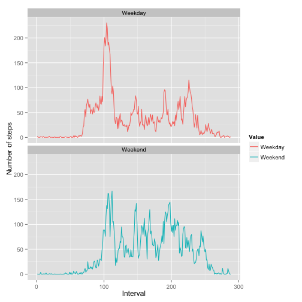

## Loading and preprocessing the data

Install and Load packages needed

```r
#install.packages("reshape2","dplyr")
library(reshape2)
library(dplyr)
library(plyr)
```

Reading input data

```r
input1 <- read.csv("activity.csv",na.strings="NA")
```
## What is mean total number of steps taken per day?
**To find the total number of steps taken per day:**

* Arrange data based on date

```r
group1 <- arrange(input1,date)
```
* Summarize data based on "date" and make it tidy

```r
melt1 <- melt(data = group1, id.vars = "date",measure.vars="steps", na.rm = T)
tidydataA <- dcast(melt1,date ~ variable, sum)

# Another way of doing sum
tidydataA_anotherway <- aggregate(.~date, group1, sum)
```
**Make a histogram of the total number of steps taken each day**

Note: Here is the main difference between bar charts and histograms. With bar charts, each column represents a group defined by a categorical variable; and with histograms, each column represents a group defined by a quantitative variable.

```r
hist(tidydataA$steps,xlab = "Total number of steps", main="Histogram 
          of total number of steps each day")
```

 

```r
dev.copy2pdf(file="plot1_hist_steps.pdf")
```

```
## RStudioGD 
##         2
```
**Calculate and report the mean and median of the total number of steps taken per day**


```r
mean1 <- mean(tidydataA$steps)
median1 <- median(tidydataA$steps)
print(mean1)
```

```
## [1] 10766.19
```

```r
print(median1)
```

```
## [1] 10765
```
## What is the average daily activity pattern?
**Make a time series plot (i.e. type = "l") of the 5-minute interval (x-axis) and the average number of steps taken, averaged across all days (y-axis)**


```r
input3 <- input1 # making a copy
input3$interval <- as.factor(input1$interval) # changing interval from int to factor
group2 <- arrange(input3, interval) #sort based on interval

tidydataB <- aggregate(.~interval, group2, mean, na.action=na.omit)
plot(x = as.numeric(tidydataB$interval), y = tidydataB$steps,xlab = "Interval",
     ylab = "Average number of steps",type = "l")
```

 

```r
#convert factor to numeric to make line plot work
```

```r
dev.copy2pdf(file = "plot2_interval.pdf")
```

```
## RStudioGD 
##         2
```
**Which 5-minute interval, on average across all the days in the dataset, contains the maximum number of steps?**


```r
max1 <- max(tidydataB$steps)
which(tidydataB$steps == max1)
```

```
## [1] 104
```

```r
tidydataB[104,] #The 835th interval
```

```
##     interval    steps     date
## 104      835 206.1698 30.71698
```
## Imputing missing values

**Calculate and report the total number of missing values in the dataset (i.e. the total number of rows with NAs)**


```r
sum(is.na(input1$steps)) #2304
```

```
## [1] 2304
```

**Devise a strategy for filling in all of the missing values in the dataset. The strategy does not need to be sophisticated. For example, you could use the mean/median for that day, or the mean for that 5-minute interval, etc**


```r
input2 <- input1 #making a copy of the input

iCount <-  1
while (iCount <= nrow(input2)) {
    oneRow <- input2[iCount,]
    if(is.na(oneRow$steps)) {
        intervalValue <- oneRow$interval
        #taking interval value from tidydataB
        matchRowNumber <- match(x = oneRow$interval,table = tidydataB$interval)  
        newStepsValue <- tidydataB$steps[matchRowNumber] 
        input2$steps[iCount] <- newStepsValue
    }
    iCount <- iCount + 1
}
```
**Create a new dataset that is equal to the original dataset but with the missing data filled in.**

The new dataset with imputed data is called 

```r
input2 
```

**Make a histogram of the total number of steps taken each day and Calculate and report the mean and median total number of steps taken per day. Do these values differ from the estimates from the first part of the assignment? What is the impact of imputing missing data on the estimates of the total daily number of steps?**


```r
group3 <- arrange(input2, interval) #sort based in interval

tidydataC1 <- aggregate(.~date, group3, sum)
hist(tidydataC1$steps,xlab = "Total number of steps",main="Histogram 
     of total number of steps each day")
```

 

```r
dev.copy2pdf(file = "plot3_after_impute.pdf")
```

```
## RStudioGD 
##         2
```

```r
mean2 <- mean(tidydataC1$steps)
median2 <- median(tidydataC1$steps)
print(mean2)
```

```
## [1] 10766.19
```

```r
print(median2)
```

```
## [1] 10766.19
```
We can see that there almost no impact of imputing when you input with mean of 5 minute interval

## Are there differences in activity patterns between weekdays and weekends?

**Create a new factor variable in the dataset with two levels – “weekday” and “weekend” indicating whether a given date is a weekday or weekend day**


```r
input2Copy <- input2
input2Copy$date <- as.Date(input2Copy$date)
input2Copy$day <- weekdays(input2Copy$date)

#vectorized operation , so it can be applied to all rows    
input2Copy[input2Copy$day %in% c("Monday","Tuesday","Wednesday","Thursday", 
                                 "Friday"),"Value"] <- "Weekday"
input2Copy[input2Copy$day %in% c("Saturday", "Sunday"),"Value"] <- "Weekend"
```

**Make a panel plot containing a time series plot (i.e. type = "l") of the 5-minute interval (x-axis) and the average number of steps taken, averaged across all weekday days or weekend days (y-axis). See the README file in the GitHub repository to see an example of what this plot should look like using simulated data.**


```r
input2CC <- input2Copy
input2CC$interval <- as.factor(input2Copy$interval) 
# changing interval from int to factor so that arrange will work
input2CCGroup <- arrange(input2CC, interval)

tidydata2CG <- aggregate(steps~interval+Value, data=input2CCGroup, mean, na.action=na.omit)
#install.packages("ggplot2")
library(ggplot2)
# ggplot or plot doesn;t work with factor variables, convert them to numeric
p <- ggplot(tidydata2CG, aes(x=as.numeric(interval),y=steps,col=Value))
p <- p + geom_line() + facet_wrap(~Value, ncol=1)
p <- p + labs(x = "Interval", y = "Number of steps")
p
```

 

```r
dev.copy2pdf(file="plot4_wkday_wkend.pdf")
```

```
## RStudioGD 
##         2
```

```r
#OR
#qplot(data=tidydata2CG,x=as.numeric(interval),y=steps, facets = Value~.,
#      geom ="line" , xlab="Interval",ylab="Number of Steps")
```

